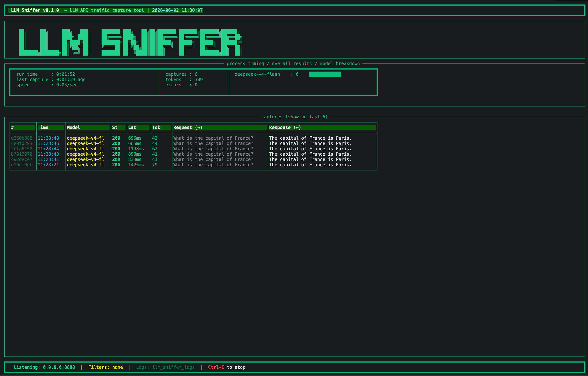

# LLM Sniffer

A Wireshark-like traffic capture tool for LLM API calls. Intercepts, displays, and logs all LLM API requests and responses in real-time with an afl-fuzz style terminal UI.

## Features

- **Traffic Interception**: Captures all LLM API calls — two modes available
- **AFL-Fuzz Style TUI**: Real-time terminal display showing captures, stats, and model breakdown
- **Flexible Filtering**: Filter captures by base_url, model name, or API key (glob/regex/exact)
- **File Logging**: All captures saved to JSONL files for later analysis
- **Multi-Provider**: Works with any OpenAI-compatible API (OpenAI, Anthropic, Groq, local models, etc.)

## Two Modes

| | Reverse Mode | mitm Mode |
|---|---|---|
| **How it works** | Change `base_url` → our proxy | Set `HTTPS_PROXY` env var |
| **Code changes** | Yes (1 line) | **None** |
| **Dependencies** | aiohttp, rich | aiohttp, rich, **mitmproxy** |
| **HTTPS support** | Direct (plain HTTP from client) | Via mitmproxy CA cert |
| **Best for** | Development, local testing | Existing apps, zero-touch capture |

## Installation

```bash
cd LLMDump
pip install -e .

# Or just install dependencies
pip install -r requirements.txt
```

## Quick Start

### Non-intrusive mode (recommended) — zero code changes

```bash
# Terminal 1: start the sniffer
llm-sniffer --mode mitm

# Terminal 2: set proxy env and run your app
export HTTPS_PROXY=http://localhost:8888
export HTTP_PROXY=http://localhost:8888
python my_llm_app.py    # ← runs completely normally!
```

This works because every major LLM SDK (OpenAI, Anthropic, LangChain, llama-index, LiteLLM, etc.) uses `httpx`/`requests`/`aiohttp` under the hood, which all respect `HTTP_PROXY`/`HTTPS_PROXY`. Your app code stays untouched.

### Reverse proxy mode — simple, no certificate needed

```bash
# Start the sniffer
llm-sniffer

# Then point your client to it
# OpenAI Python SDK:
from openai import OpenAI
client = OpenAI(base_url="http://localhost:8888/v1", api_key="sk-...")
```

## How It Works

```
Reverse Mode:
  LLM Client ──→ LLM Sniffer (:8888) ──→ Actual API (api.openai.com)
  (base_url changed)      │
                           ├── TUI Display (afl-fuzz style)
                           └── Log Files (JSONL)

mitm Mode:
  LLM Client ──→ HTTPS_PROXY ──→ LLM Sniffer (:8888) ──→ Actual API
  (no code changes!)                        │
                                            ├── TUI Display
                                            └── Log Files (JSONL)
```

## CLI Options

### Mode
| Flag | Default | Description |
|------|---------|-------------|
| `-m`, `--mode` | `reverse` | `reverse` (change base_url) or `mitm` (set HTTPS_PROXY) |

### Server Options
| Flag | Default | Description |
|------|---------|-------------|
| `--host` | `0.0.0.0` | Listen address |
| `-p`, `--port` | `8888` | Listen port |
| `-t`, `--target` | `https://api.openai.com` | Upstream API URL (reverse mode only) |

### Filter Options
| Flag | Description |
|------|-------------|
| `--filter-url` | Only show captures matching this URL pattern |
| `--filter-model` | Only show captures matching this model pattern |
| `--filter-apikey` | Only show captures matching this API key pattern |
| `--exclude-url` | Hide captures matching this URL pattern |
| `--exclude-model` | Hide captures matching this model pattern |
| `--exclude-apikey` | Hide captures matching this API key pattern |
| `--pattern-mode` | `glob` (default), `regex`, or `exact` |

### Logging Options
| Flag | Default | Description |
|------|---------|-------------|
| `-o`, `--output` | `./llm_sniffer_logs` | Log output directory |

## TUI Display



The terminal UI shows (afl-fuzz style):
- **Banner**: Tool name and version
- **Process Timing**: Uptime, last capture, capture rate
- **Overall Results**: Total captures, tokens, errors
- **Model Breakdown**: Per-model request counts with bars
- **Capture Table**: Live-scrolling list of recent captures with ID, time, model, status, latency, tokens, summary
- **Footer**: Active filters, log directory, controls

## Log Format

Captures are saved as JSONL files in the log directory:

```json
{
  "id": "a1b2c3d4",
  "timestamp": "2026-06-01T20:00:00",
  "base_url": "https://api.openai.com",
  "model": "gpt-4",
  "api_key_prefix": "sk-a***b1c2",
  "stream": false,
  "latency_ms": 1234.56,
  "status_code": 200,
  "prompt_tokens": 100,
  "completion_tokens": 50,
  "total_tokens": 150,
  "request_messages": [...],
  "response_choices": [...]
}
```

## License

MIT
